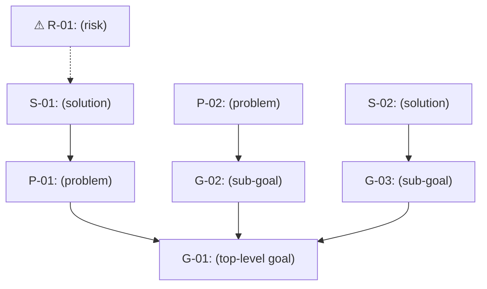

# Alignment Diagram
<!-- Directed graph: goals at top, solutions at bottom, arrows pointing upward showing contribution/resolution.
     Problems sit below the goals they obstruct. Solutions sit below the problems they resolve.
     Risks point at the solutions they threaten. -->

