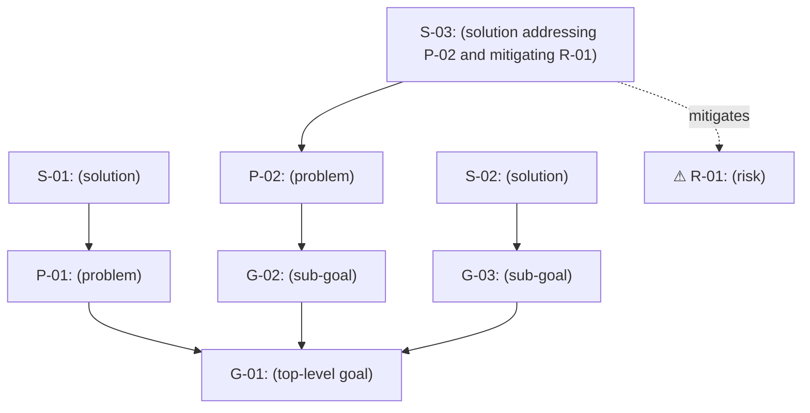

# Alignment Diagram

> **Methodology Review Status**
> Last comprehensive review: <YYYY-MM-DD> by <reviewer name>
> Covers: traceability + defensibility
<!-- This banner is updated by the analysis-review skill on completion of
     traceability and defensibility checks. Skills that modify this file
     reset the banner to a "Modified since last review" state. See
     docs/03-design/analysis-review-mechanism.md for details. -->

<!-- Directed graph: goals at top, solutions at bottom, arrows pointing
     upward showing how solutions address problems and advance goals.
     Problems sit below the goals they obstruct.
     Risks are connected to the solutions that mitigate them via a
     `mitigates` edge from the solution to the risk.
     Mitigations are not separate nodes — a solution that mitigates a risk
     simply carries a mitigates edge. -->

